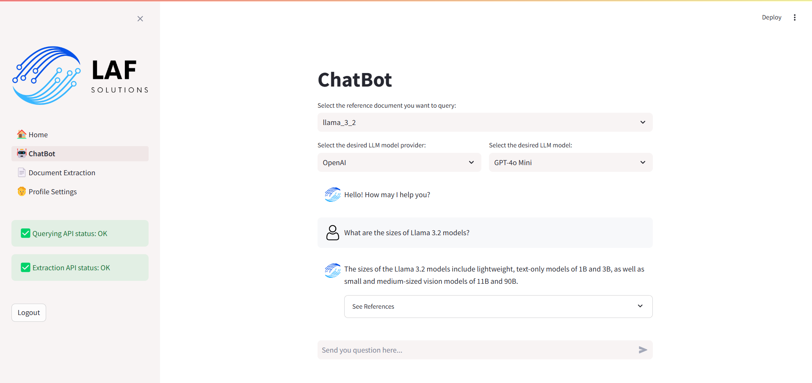

You can find the complete open-source project on GitHub: [lafidalgo/context-chatbot](https://github.com/lafidalgo/context-chatbot).

### Achievements

- Developed a **Knowledge-Based LLM ChatBot prototype**, integrating microservices for document extraction, storage, and querying. Utilized **Retrieval-Augmented Generation (RAG)** to enhance query responses.
- Leveraged open-source technologies such as **FastAPI**, **Docker**, **Qdrant**, and **LlamaIndex** to create scalable, containerized solutions.
- Designed an interactive user interface using **Streamlit**, enabling users to interact with the system and visualize LLM-based responses.
- Implemented automated **Docker image generation** and deployment with **GitHub Actions**, streamlining the CI/CD pipeline.

### Context

This project aimed to demonstrate how **unstructured text documents** can be effectively processed, stored, and queried. By leveraging **Retrieval-Augmented Generation (RAG)**, the system retrieves relevant information and generates contextually accurate responses.

The prototype consists of the following key components:
- **Text ingestion**: Processes files or URLs to extract text content.
- **Storage**: Stores processed content in a **Vector Database** (Qdrant) for efficient retrieval.
- **Querying**: Allows users to query the database using a **Large Language Model (LLM)** for intelligent, contextual responses.
- **User Interaction**: A **Streamlit** interface for seamless interaction and visualization of responses.

### Technologies Used

- **FastAPI**: For developing robust microservices.
- **Docker**: To containerize the application for easy deployment and scalability.
- **Qdrant**: As the vector database for efficient content storage and retrieval.
- **LlamaIndex**: To index and query documents effectively.
- **Streamlit**: For creating a user-friendly interface.
- **GitHub Actions**: For automating the CI/CD pipeline.
