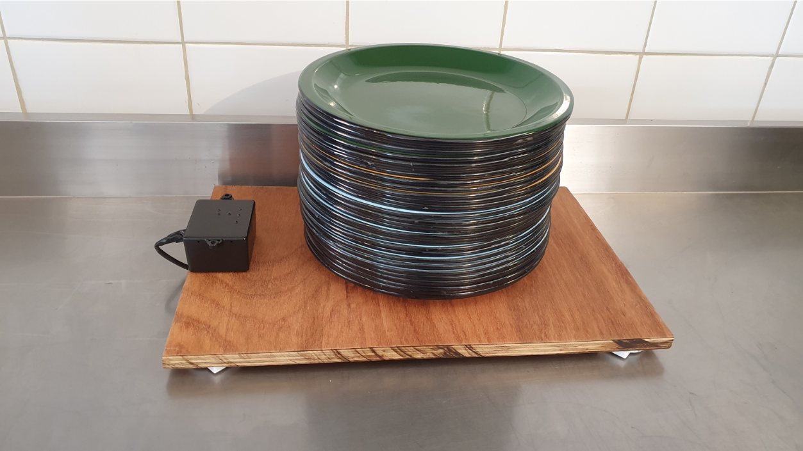

This was my **Bachelor’s Final Thesis** at the University of Brasília.

You can find the full article here (in Portuguese): [Final Thesis](https://drive.google.com/file/d/1Nze9oxfN0Qon8igrcGOa-336x2AxX0GE/view?usp=sharing).

### Achievements

- Developed an **automated inventory and warehouse management solution** utilizing **wireless communication** and **battery-powered devices**. 
- Ensured **long-term usability** with a **battery lifespan of 1 year and 6 months** for the sensor system, reducing maintenance efforts.
- Integrated the system with **cloud services**, enabling **real-time data access** through a dedicated application.
- Achieved **high accuracy in weight measurements** with an error margin below **1%**, meeting the strict requirements of the application.
- Leveraged the **ESP32 module** with **ESP-NOW wireless communication**, demonstrating practical applications of **low-power strategies** in embedded systems.

### Context

This project addressed the challenge of automating inventory management for **utensils at a food complex**, where the mobility of storage units rendered traditional power and network infrastructure impractical. The solution was designed to provide **real-time data access** while being **battery-powered**, ensuring flexibility and ease of use. 

The system utilized:
- **ESP32 microcontroller** for processing and wireless communication.
- **ESP-NOW protocol** for low-power, low-latency wireless data transmission.
- **Load cells with the HX711 module** for precise weight measurement.
- **Cloud integration** to enable remote monitoring and management.

### Technologies Used

- **Hardware Development**: Designed a robust system with low-power consumption.
- **Microcontrollers**: Utilized the ESP32 for its processing power and wireless capabilities.
- **Wireless Communications Systems**: Implemented the ESP-NOW protocol for efficient data transmission.
- **Software Development**: Developed embedded firmware in **C/C++** for sensor integration and communication.
- **Cloud Services**: Enabled real-time data access via the cloud.
- **Debugging Tools**: Ensured reliability through testing and debugging.